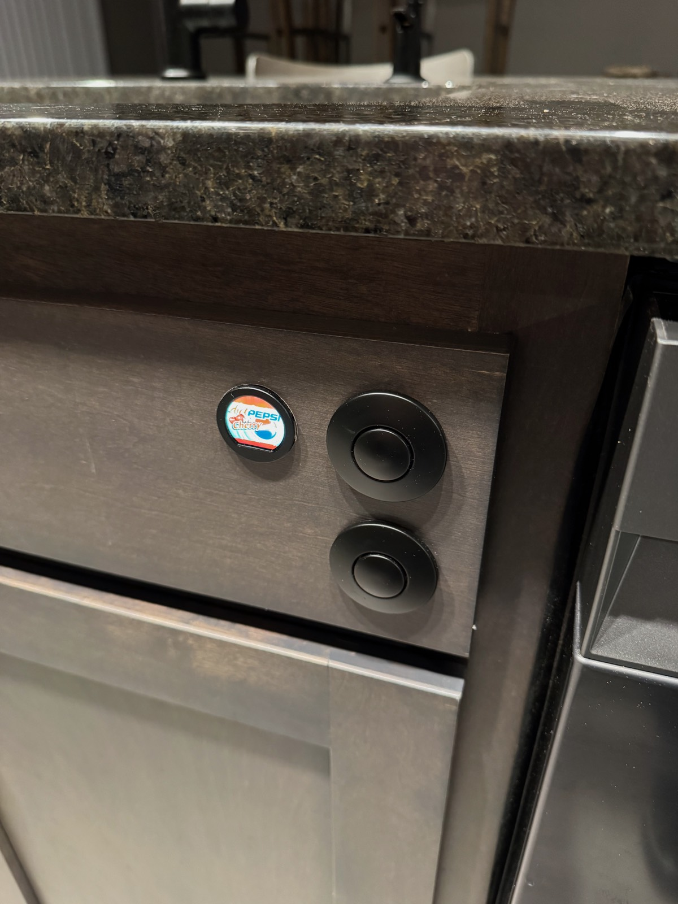
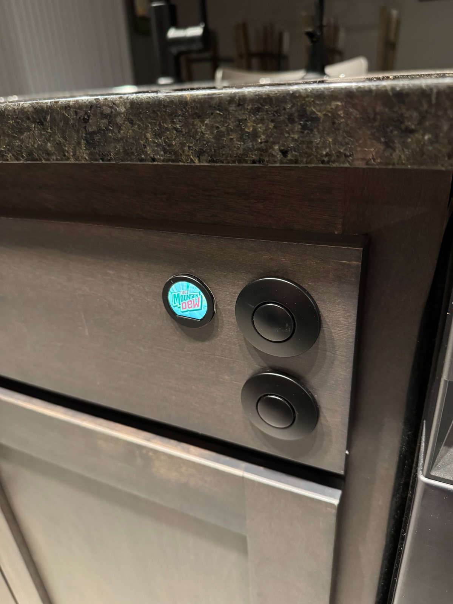
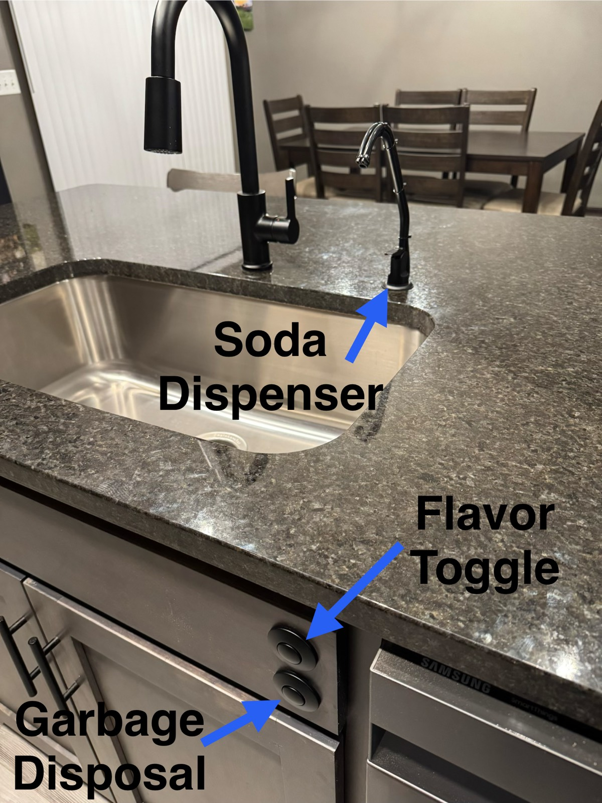
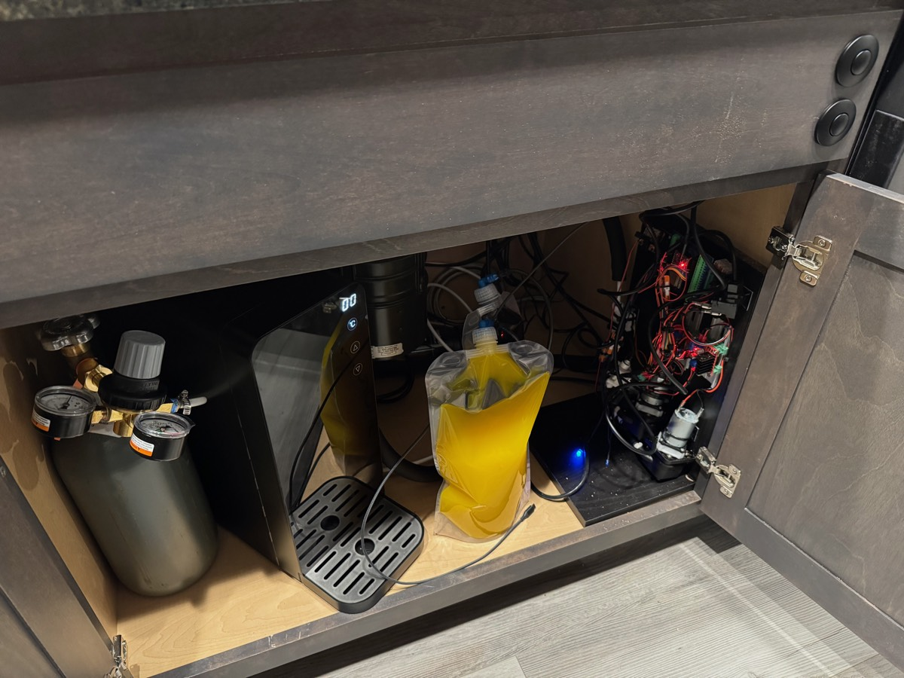
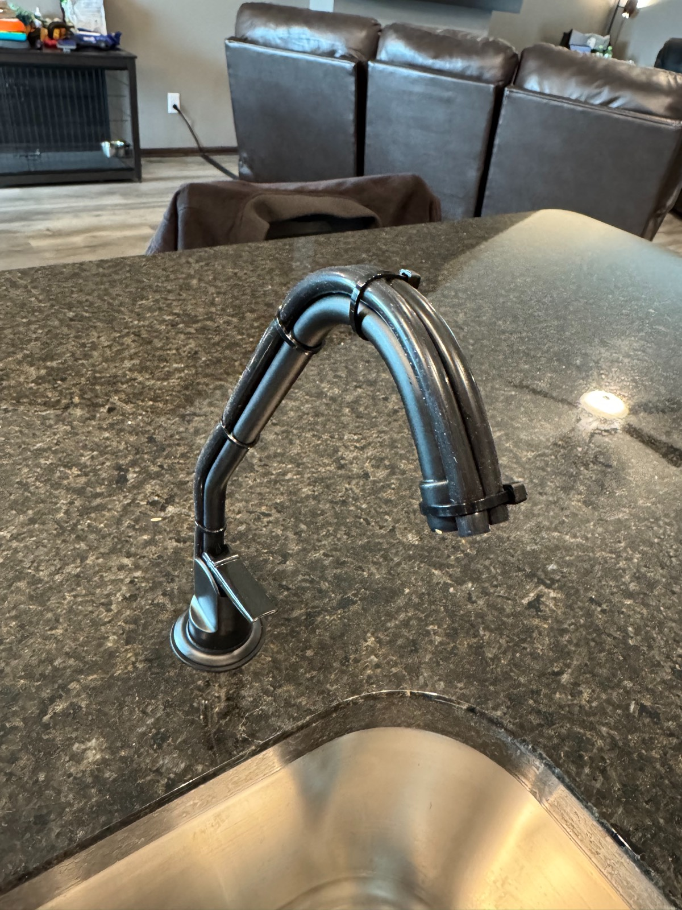
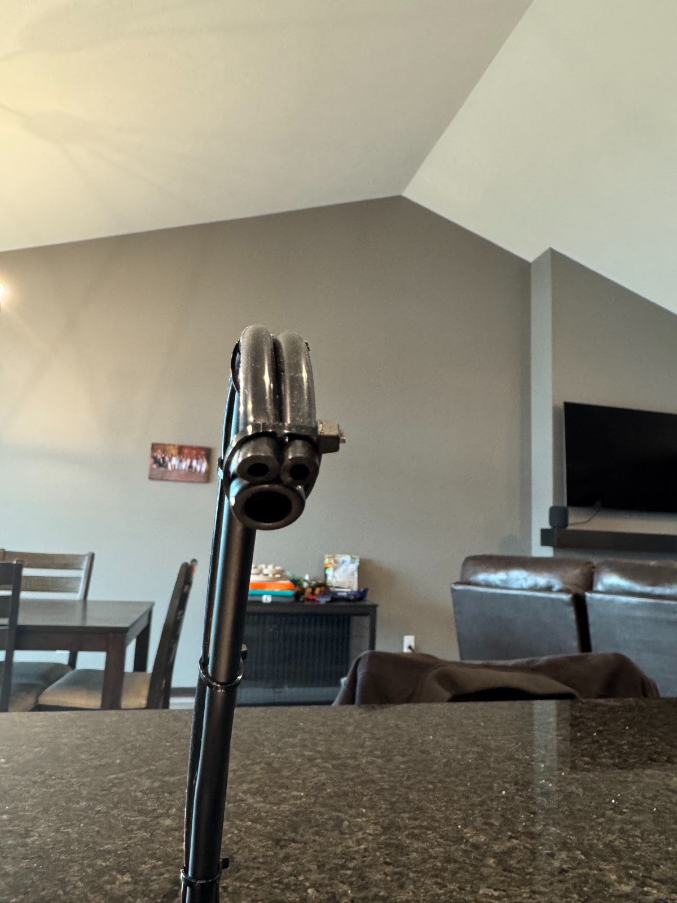
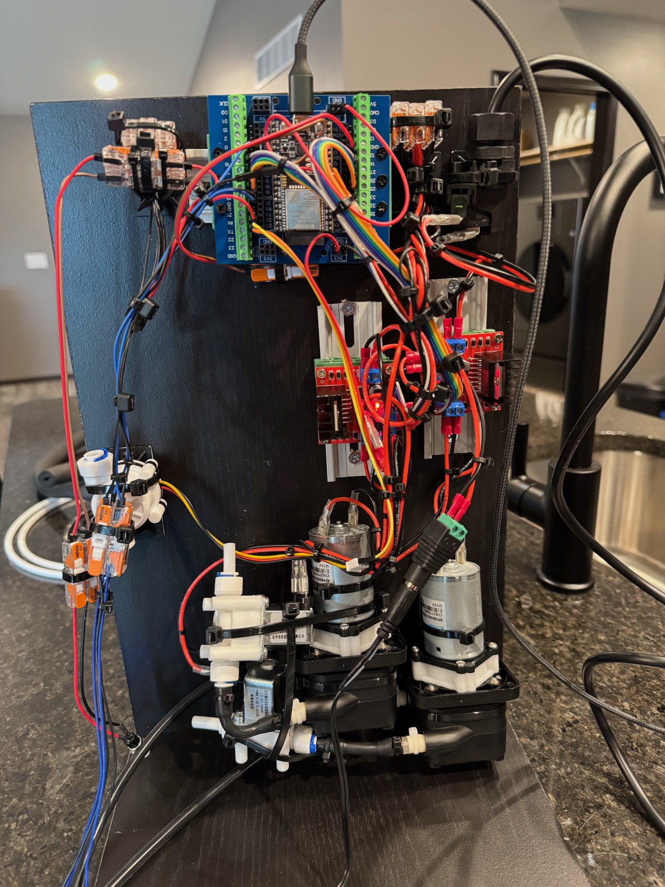

# Soda Flavor Injector

ESP32 + RP2040 + ESP32-S3 project that injects flavoring concentrate into cold carbonated water from an under-counter carbonator. Peristaltic pumps duty-cycle based on real-time flow meter readings to maintain consistent flavor strength. A round LCD display shows which flavor is selected, and a separate rotary touchscreen display lets you change flavor images and ratios at runtime.

<p align="center">
  
  
</p>
<p align="center"><em>The RP2040 round LCD shows the active flavor. An air switch button toggles between flavors.</em></p>

https://github.com/user-attachments/assets/ddd9bcfd-567e-414a-80be-4f5125431bac

<p align="center"><em>Changing flavor images and ratios on the config display, then pouring a glass with both flavors.</em></p>

## How It Works

Cold carbonated water flows from an under-counter carbonator through a dispenser faucet. When you open the faucet, a flow meter detects water movement and the system automatically kicks in:

1. A solenoid valve opens (it stays closed between uses to prevent backflow and keep the lines primed)
2. A peristaltic pump injects concentrate from a collapsible reservoir
3. The pump duty-cycles on/off proportionally to the detected flow rate
4. Concentrate meets the water stream at the faucet spout

A toggle switch (an air switch) selects between two flavors. The small LCD display updates to show which flavor is active.

<p align="center">
  
</p>
<p align="center"><em>The countertop: a dedicated dispenser faucet and a flavor toggle air switch.</em></p>

### Under the Counter

Everything lives inside the sink cabinet:

<p align="center">
  
</p>
<p align="center"><em>Left to right: CO2 tank with dual-gauge regulator, Lilium carbonator, Platypus bag filled with concentrate, and the control panel with pumps and valves.</em></p>

Silicone concentrate lines are zip-tied to the outside of the faucet gooseneck:

<p align="center">
  
  
</p>

### Architecture

The system runs on three microcontrollers:

- **ESP32** — Main controller. Reads the flow meter, drives pumps and valves via L298N motor drivers, manages the pump state machine, stores config in LittleFS, and coordinates the other boards over UART using TinyProto (HDLC full-duplex reliable delivery).
- **RP2040** (Waveshare RP2040-LCD-0.99) — Display controller. Shows the selected flavor logo on a 128x115 round LCD. Reads the same physical toggle switch for instant visual feedback.
- **ESP32-S3** (Meshnology 1.28" Round Rotary Display) — Config display. A 240x240 round touchscreen with a rotary encoder for changing flavor images and ratios at runtime. Also serves as a BLE bridge between the iOS app and ESP32. Syncs config to the ESP32 over UART.

```
                        ┌─────────────────────┐
  Carbonated Water ───→ │ Flow Meter (GPIO 23) │
                        └──────────┬──────────┘
                                   │ pulses
  ┌───────────────┐     ┌──────────▼──────────┐
  │ ESP32-S3      │     │   ESP32 Controller   │
  │ Config Display│     │                      │
  │ 240x240 touch │◄───►│  Pump State Machine   │
  │ + encoder     │UART │  IDLE → ON → OFF ──→ │──(cycle repeats)
  │               │9600 │    └── COOLDOWN       │
  └───────────────┘     │    └── PRIME (via UI)  │
                        └──┬────────┬────────┬─┘
                           │        │        │
                    UART TX│   L298N A  L298N B
                    9600   │   ┌────┴┐  ┌───┴──┐
                           │   │Pump1│  │Pump2 │
              ┌────────────▼┐  │Valve│  │Valve │
              │ RP2040 LCD  │  └─────┘  └──────┘
              │ 128x115 px  │
              │ flavor logo │
              └─────────────┘
```

### Pump Control

The pump doesn't just run at a fixed speed. It duty-cycles (on/off/on/off) with timing that adapts to how fast water is flowing:

| Flow Rate | On Time | Off Time | Duty Cycle |
|-----------|---------|----------|------------|
| Slow (1 pulse/50ms) | 50ms | 600ms | ~8% |
| Full (6 pulses/50ms) | 200ms | 300ms | ~40% |

This is further scaled by a per-flavor **ratio** parameter (configurable at runtime via the config display):
- Ratio 20 — tuned for SodaStream concentrates (1:20 concentrate-to-water)
- Ratio 6 — for bag-in-box syrup (traditional fountain ratio)

## Parts List

Nearly everything was sourced from Amazon Prime. The only exception is the carbonated water machine.

### Electronics

| Part | Purpose |
|------|---------|
| [ESP32-DevKitC-32E](https://www.amazon.com/dp/B09MQJWQN2) | Main controller |
| [ESP32 DIN Rail Breakout Board](https://www.amazon.com/dp/B0BW4SJ5X2) | Clean wiring for ESP32 GPIOs |
| [Waveshare RP2040 Round LCD (0.99")](https://www.amazon.com/dp/B0CTSPYND2) | Flavor display (128x115 GC9107) |
| [Meshnology ESP32-S3 1.28" Round Rotary Display](https://www.amazon.com/dp/B0G5Q4LXVJ) | Config display (240x240 GC9A01A, touch + encoder) |
| [L298N Dual H-Bridge Motor Driver](https://www.amazon.com/dp/B0C5JCF5RS) x2 (link is a 4-pack) | Drive pumps and solenoid valves |
| [12V 2A Power Supply](https://www.amazon.com/dp/B0DZGTTBGZ) | Powers pumps and valves |

### Pumps and Valves

| Part | Purpose |
|------|---------|
| [Kamoer Peristaltic Pump (400ml/min, 12V)](https://www.amazon.com/dp/B09MS6C91D) x2 | Dispense flavor concentrate |
| [Beduan 12V Solenoid Valve (1/4")](https://www.amazon.com/dp/B07NWCQJK9) x2 | Prevent backflow, keep concentrate lines primed |

### Sensors and Switches

| Part | Purpose |
|------|---------|
| [DIGITEN G3/8" Hall Effect Flow Sensor](https://www.amazon.com/dp/B07QQW4C7R) | Measure water flow rate |
| [KRAUS Garbage Disposal Air Switch (Matte Black)](https://www.amazon.com/dp/B096319GMV) | Flavor toggle (countertop safe, no electricity) |

### Plumbing

| Part | Purpose |
|------|---------|
| [Westbrass Cold Water Dispenser Faucet (Matte Black)](https://www.amazon.com/dp/B0BXFW1J38) | Dispensing tap at the counter |
| [Platypus 2L Collapsible Bottle](https://www.amazon.com/dp/B000J2KEGY) x2 | Flavor concentrate reservoirs |
| [Platypus Hydration Drink Tube Kit](https://www.amazon.com/dp/B07N1T6LNW) | Tubing + bite valve for reservoirs |
| [Silicone Tubing (1/8" ID x 1/4" OD)](https://www.amazon.com/dp/B0BM4KQ6RT) | Food-grade tubing for concentrate lines |
| [Waterdrop 15UC-UF Inline Water Filter](https://www.amazon.com/dp/B085G9TZ4L) | Filters water before carbonation |

### Flavor Concentrates

| Part | Notes |
|------|-------|
| [SodaStream Pepsi Wild Cherry Zero Sugar](https://www.amazon.com/dp/B0G4NRDQB8) | Default ratio 1:20 |
| [SodaStream Diet MTN Dew](https://www.amazon.com/dp/B0CS191QMW) | Default ratio 1:20 |

### Wiring and Connectors

| Part | Purpose |
|------|---------|
| [Dupont Jumper Wires (120-pack M/F, M/M, F/F)](https://www.amazon.com/dp/B0BRTJXND9) | Board-to-board connections |
| [Female Spade Crimp Terminals (60-pack)](https://www.amazon.com/dp/B0B9MZJ2ML) | Motor and valve connections |
| [Male Quick Disconnect Spade Connectors (100-pack)](https://www.amazon.com/dp/B01MZZGAJP) | Motor and valve connections |

### Mounting and Hardware

| Part | Purpose |
|------|---------|
| [Zip Ties (200-pack)](https://www.amazon.com/dp/B0BC1VH4XB) | Secure tubing to faucet, cable management |
| [12"x24" Laminate Shelf](https://www.homedepot.com/p/328395734) | Cut in half and screwed together as mounting panel |
| [#8 x 1/2" Wood Screws (100-pack)](https://www.homedepot.com/p/204275505) | Mount components to panel |
| ~~[Pre-wired 12V LEDs (120-pack, 6 colors)](https://www.amazon.com/dp/B07PVVL2S6)~~ | ~~Flavor indicator LEDs~~ (removed — RP2040 display replaced LEDs) |

### Carbonated Water

| Part | Purpose |
|------|---------|
| [Lilium Under-Sink Carbonated Water Dispenser](https://liliumfaucet.com/products/under-sink-carbonated-soda-maker-sparkling-water-dispenser-with-3-way-faucet) | Cold carbonated water source (not from Amazon) |
| [TAPRITE Dual-Gauge CO2 Regulator](https://www.amazon.com/dp/B00L38DRD0) | CO2 pressure regulation |
| 5 lb CO2 Tank + First Refill | CO2 source (refills ~$25 at welding/homebrew shops) |

### Tools

Most builders will already have these on hand.

| Tool | Purpose |
|------|---------|
| [RYOBI ONE+ 18V Drill/Driver Kit](https://www.homedepot.com/p/326680222) | Drilling and driving screws |
| [RYOBI Drill Bit Set (15-piece)](https://www.homedepot.com/p/315853368) | General-purpose drill bits |
| [Milwaukee 1-1/4" Hole Dozer with Arbor](https://www.homedepot.com/p/202327734) | Countertop holes for faucet and air switch |
| [Wiss 10" Tradesmen Scissors](https://www.homedepot.com/p/313487663) | Cutting tubing and zip ties |
| [Husky Precision Screwdriver Set (7-piece)](https://www.homedepot.com/p/302435926) | Electronics work |
| [Klein Tools 3005CR Ratcheting Crimper (10-22 AWG)](https://www.amazon.com/dp/B07WMB61J5) | Crimp spade terminals |
| [Apple USB-C to USB-C Cable (2m)](https://www.amazon.com/dp/B0DCH5B2HF) | Flash the RP2040 |
| [LISEN USB-C to Micro USB Cable (2-pack)](https://www.amazon.com/dp/B0D3BXM91B) | Flash the ESP32 |

## Wiring

<p align="center">
  
</p>
<p align="center"><em>The control panel: ESP32 on a DIN rail breakout board (top), two L298N motor drivers (red boards), two Kamoer peristaltic pumps, and two solenoid valves (bottom).</em></p>

### ESP32 Pin Assignments

**L298N Board A (Flavor 1):**

| Function | GPIO | Notes |
|----------|------|-------|
| ENA (pump PWM) | 33 | |
| IN1 (pump dir) | 25 | |
| IN2 (pump dir) | 26 | |
| ENB (valve on/off) | 12 | IN3/IN4 hardwired on board (IN3→5V, IN4→GND) |

**L298N Board B (Flavor 2):**

| Function | GPIO | Notes |
|----------|------|-------|
| ENA (pump PWM) | 19 | |
| IN1 (pump dir) | 18 | |
| IN2 (pump dir) | 5 | |
| ENB (valve on/off) | 4 | IN3/IN4 hardwired on board (IN3→5V, IN4→GND) |

**Inputs and Communication:**

| Function | GPIO | Notes |
|----------|------|-------|
| Flavor toggle switch | 13 | Air switch, INPUT_PULLUP |
| Flow meter | 23 | Hall effect, FALLING edge interrupt |
| Display UART TX | 32 | 38400 baud, TinyProto HDLC to RP2040 (Serial2) |
| Display UART RX | 35 | 38400 baud, TinyProto HDLC from RP2040 |
| Config UART TX | 15 | 38400 baud, TinyProto HDLC to ESP32-S3 (Serial1) |
| Config UART RX | 34 | 38400 baud, TinyProto HDLC from ESP32-S3 (input-only pin) |

| RTC SDA (DS3231) | 21 | I2C, Wire library |
| RTC SCL (DS3231) | 22 | I2C, Wire library |

**Freed GPIOs** (LEDs removed, valve IN3/IN4 hardwired): 2, 27, 17, 16. GPIOs 27 and 17 are reserved for clean cycle solenoids (L298N Board #3).

### RP2040 Pin Assignments

| Function | GPIO | Notes |
|----------|------|-------|
| Flavor toggle switch | 29 | Same physical switch as ESP32 |
| UART TX (to ESP32) | 27 | PIO-based serial, 38400 baud, TinyProto HDLC |
| UART RX (from ESP32) | 26 | PIO-based serial, 38400 baud, TinyProto HDLC |
| LCD DC | 8 | Fixed on board |
| LCD CS | 9 | Fixed on board |
| LCD CLK | 10 | Fixed on board |
| LCD DIN | 11 | Fixed on board |
| LCD RST | 13 | Fixed on board |
| LCD Backlight | 25 | Fixed on board |

### ESP32-S3 Pin Assignments (Meshnology 1.28")

All pins are fixed by the board design.

| Function | GPIO | Notes |
|----------|------|-------|
| LCD SPI MOSI | 11 | GC9A01A, 240x240 |
| LCD SPI SCLK | 10 | |
| LCD CS | 9 | |
| LCD DC | 3 | |
| LCD RST | 14 | |
| LCD Backlight | 46 | |
| Display power 1 | 1 | Must be set HIGH |
| Display power 2 | 2 | Must be set HIGH |
| Touch SDA | 6 | CST816D, Wire1 I2C |
| Touch SCL | 7 | |
| Touch INT | 5 | |
| Touch RST | 13 | |
| Encoder CLK | 45 | |
| Encoder DT | 42 | |
| Encoder BTN | 41 | |
| RGB LEDs | 48 | WS2812 x5 (unused) |
| UART TX (J34) | 43 | 38400 baud, TinyProto HDLC to ESP32 |
| UART RX (J34) | 44 | 38400 baud, TinyProto HDLC from ESP32 |

### Inter-Board Communication

All inter-MCU communication uses [TinyProto](https://github.com/lexus2k/tinyproto) at 38400 baud with HDLC full-duplex framing. Text commands are sent inside `MSG_TEXT` messages; binary image uploads use a state-based protocol where TinyProto handles fragmentation, ACKs, and retransmission internally.

**ESP32 ↔ RP2040 (bidirectional, Serial2, GPIO 32 TX / GPIO 35 RX):**

The ESP32 pushes flavor images, label mappings, and config to the RP2040. The RP2040 sends `MSG_DEVICE_READY` at boot with its image count, triggering a full sync. The ESP32 also re-syncs periodically (every 30 seconds) as a safety net.

**ESP32 ↔ ESP32-S3 (bidirectional, Serial1, GPIO 15 TX / GPIO 34 RX):**

The ESP32-S3 config display communicates with the ESP32 to read and write runtime configuration. The ESP32 is the single source of truth; config is persisted in LittleFS. The S3 also acts as a BLE bridge, forwarding commands from the iOS app to the ESP32.

Text commands are wrapped in `MSG_TEXT` messages. On boot, the S3 sends `GET_CONFIG` until the ESP32 responds. When the user changes a value on the config display (or via the iOS app over BLE), the S3 sends `SET:` followed by `SAVE`.

```
S3 → ESP32:  GET_CONFIG
ESP32 → S3:  CONFIG:F1_RATIO=20,F2_RATIO=20,F1_IMAGE=0,F2_IMAGE=1,numImages=3

S3 → ESP32:  SET:F1_RATIO=18
ESP32 → S3:  OK:F1_RATIO=18

S3 → ESP32:  SET:F1_IMAGE=2
ESP32 → S3:  OK:F1_IMAGE=2

S3 → ESP32:  SET:F1_RATIO=30
ESP32 → S3:  ERR:F1_RATIO out of range

S3 → ESP32:  SAVE
ESP32 → S3:  OK:SAVED              (persists to LittleFS)
```

Valid keys and ranges: `F1_RATIO` (6-24), `F2_RATIO` (6-24), `F1_IMAGE` (0-NUM_IMAGES-1), `F2_IMAGE` (0-NUM_IMAGES-1). The same text commands work over USB serial (115200 baud) for testing.

Boot order does not matter. The S3 retries `GET_CONFIG` until the ESP32 is ready. Both the RP2040 and S3 send `MSG_DEVICE_READY` at the end of their `setup()`, and the ESP32 uses this to trigger initial sync.

## Building and Flashing

This is a [PlatformIO](https://platformio.org/) project with three build environments.

### Flash the ESP32 (main controller)

```bash
pio run -e esp32dev -t upload
```

### Flash the RP2040 (display)

```bash
pio run -e rp2040_display -t upload
```

The RP2040 uses the [earlephilhower Arduino core](https://github.com/earlephilhower/arduino-pico) and the [GFX Library for Arduino](https://github.com/moononournation/Arduino_GFX) for the GC9107 LCD driver.

### Flash the ESP32-S3 (config display)

```bash
pio run -e esp32s3_config -t upload
```

The ESP32-S3 uses the [pioarduino platform](https://github.com/pioarduino/platform-espressif32) for Arduino core 3.x support, [LVGL v8.4](https://github.com/lvgl/lvgl) for the UI, and the [GFX Library for Arduino](https://github.com/moononournation/Arduino_GFX) for the GC9A01A display driver. A custom 64px Montserrat font (`src_config/font_ratio_64.h`) is used for the ratio edit screen.

### Adding a New Flavor Image

Flavor images can be uploaded at runtime from the iOS app over BLE. The iOS app resizes images to the correct dimensions (128x115 for RP2040, 240x240 for S3), converts them to RGB565 format, and uploads them over the framed BLE/UART protocol. Images are stored in LittleFS on each device and survive power cycles.

Factory default images are compiled into the ESP32 firmware via `board_build.embed_txtfiles` and pushed to devices on first boot.

**Adding a new factory default image:**

1. Place the source PNG in `tools/` and run `python tools/png_to_rgb565.py` to generate RGB565 binary files
2. Add the binary files to `data/` for LittleFS upload
3. Update the factory defaults configuration

## Configuration

### Runtime Config (via iOS App, Config Display, or USB Serial)

Flavor ratios and display image assignments are stored in the ESP32's LittleFS filesystem and can be changed at runtime using the ESP32-S3 config display, the iOS app (over BLE), or by sending commands over USB serial:

| Parameter | Range | Default | Description |
|-----------|-------|---------|-------------|
| F1_RATIO | 6-24 | 20 | Flavor 1 concentrate-to-water ratio (lower = stronger) |
| F2_RATIO | 6-24 | 20 | Flavor 2 concentrate-to-water ratio |
| F1_IMAGE | 0-N | 0 | Flavor 1 display image index (images uploadable via iOS app) |
| F2_IMAGE | 0-N | 1 | Flavor 2 display image index |

To change config over USB serial (115200 baud), connect to the ESP32 and send text commands like `SET:F1_RATIO=18` followed by `SAVE`. Send `GET_CONFIG` to see current values.

### Compile-Time Tuning

These control the pump duty cycle shape and generally don't need adjustment. They are `#define`s at the top of `src/main.cpp`:

```cpp
#define PUMP_ON_MIN_MS     50    // minimum pump on-time
#define PUMP_OFF_MAX_MS  1000    // maximum pump off-time
#define SHAPE_ON_BASE     20     // base on-time at minimum flow
#define SHAPE_ON_SLOPE    30     // on-time increase per flow pulse
#define SHAPE_OFF_BASE   660     // base off-time at minimum flow
#define SHAPE_OFF_SLOPE   60     // off-time decrease per flow pulse
```

## Cost Breakdown

Prices as of March 2026.

| Part | Price | Qty | Cost |
|------|------:|----:|-----:|
| [ESP32-DevKitC-32E](https://www.amazon.com/dp/B09MQJWQN2) | $11.00 | 1 | $11.00 |
| [ESP32 DIN Rail Breakout Board](https://www.amazon.com/dp/B0BW4SJ5X2) | $25.99 | 1 | $25.99 |
| [Waveshare RP2040 Round LCD (0.99")](https://www.amazon.com/dp/B0CTSPYND2) | $23.99 | 1 | $23.99 |
| [Meshnology ESP32-S3 1.28" Round Rotary Display](https://www.amazon.com/dp/B0G5Q4LXVJ) | $47.76 | 1 | $47.76 |
| [L298N Motor Driver (4-pack)](https://www.amazon.com/dp/B0C5JCF5RS) | $9.99 | 1 | $9.99 |
| [12V 2A Power Supply](https://www.amazon.com/dp/B0DZGTTBGZ) | $9.99 | 1 | $9.99 |
| [Kamoer Peristaltic Pump](https://www.amazon.com/dp/B09MS6C91D) | $32.55 | 2 | $65.10 |
| [Beduan 12V Solenoid Valve](https://www.amazon.com/dp/B07NWCQJK9) | $8.99 | 2 | $17.98 |
| [DIGITEN Flow Sensor](https://www.amazon.com/dp/B07QQW4C7R) | $7.99 | 1 | $7.99 |
| [KRAUS Air Switch](https://www.amazon.com/dp/B096319GMV) | $39.95 | 1 | $39.95 |
| [7mm Momentary Push Buttons (12-pack)](https://www.amazon.com/dp/B0F43GYWJ6) | $7.39 | 1 | $7.39 |
| [Westbrass Dispenser Faucet](https://www.amazon.com/dp/B0BXFW1J38) | $30.00 | 1 | $30.00 |
| [Platypus 2L Collapsible Bottle](https://www.amazon.com/dp/B000J2KEGY) | $15.94 | 2 | $31.88 |
| [Platypus Drink Tube Kit](https://www.amazon.com/dp/B07N1T6LNW) | $24.95 | 1 | $24.95 |
| [Silicone Tubing (6m)](https://www.amazon.com/dp/B0BM4KQ6RT) | $12.99 | 1 | $12.99 |
| [Waterdrop Inline Water Filter](https://www.amazon.com/dp/B085G9TZ4L) | $62.99 | 1 | $62.99 |
| [Dupont Jumper Wires (120-pack)](https://www.amazon.com/dp/B0BRTJXND9) | $5.97 | 1 | $5.97 |
| [Female Spade Crimp Terminals (60-pack)](https://www.amazon.com/dp/B0B9MZJ2ML) | $9.99 | 1 | $9.99 |
| [Male Spade Connectors (100-pack)](https://www.amazon.com/dp/B01MZZGAJP) | $5.99 | 1 | $5.99 |
| [TAPRITE CO2 Regulator](https://www.amazon.com/dp/B00L38DRD0) | $92.95 | 1 | $92.95 |
| 5 lb CO2 Tank + First Refill | $139.00 | 1 | $139.00 |
| [Zip Ties (200-pack)](https://www.amazon.com/dp/B0BC1VH4XB) | $3.99 | 1 | $3.99 |
| [12"x24" Laminate Shelf](https://www.homedepot.com/p/328395734) | $12.98 | 1 | $12.98 |
| [#8 x 1/2" Wood Screws (100-pack)](https://www.homedepot.com/p/204275505) | $6.87 | 1 | $6.87 |
| [SodaStream Pepsi Wild Cherry (4-pack)](https://www.amazon.com/dp/B0G4NRDQB8) | $28.99 | 1 | $28.99 |
| [SodaStream Diet MTN Dew (4-pack)](https://www.amazon.com/dp/B0CS191QMW) | ~$29 | 1 | ~$29 |
| **Subtotal (without carbonator)** | | | **~$766** |
| [Lilium Under-Sink Carbonator](https://liliumfaucet.com/products/under-sink-carbonated-soda-maker-sparkling-water-dispenser-with-3-way-faucet) | $1,039.00 | 1 | $1,039.00 |
| **Subtotal (all parts)** | | | **~$1,805** |
| *Tools (if not already owned):* | | | |
| [RYOBI Drill/Driver Kit](https://www.homedepot.com/p/326680222) | $49.97 | 1 | $49.97 |
| [RYOBI Drill Bit Set (15-piece)](https://www.homedepot.com/p/315853368) | $12.97 | 1 | $12.97 |
| [Milwaukee 1-1/4" Hole Dozer with Arbor](https://www.homedepot.com/p/202327734) | $16.47 | 1 | $16.47 |
| [Wiss 10" Tradesmen Scissors](https://www.homedepot.com/p/313487663) | $21.97 | 1 | $21.97 |
| [Husky Precision Screwdriver Set](https://www.homedepot.com/p/302435926) | $4.88 | 1 | $4.88 |
| [Klein Tools 3005CR Ratcheting Crimper](https://www.amazon.com/dp/B07WMB61J5) | $34.96 | 1 | $34.96 |
| [Apple USB-C to USB-C Cable (2m)](https://www.amazon.com/dp/B0DCH5B2HF) | $18.00 | 1 | $18.00 |
| [LISEN USB-C to Micro USB Cable (2-pack)](https://www.amazon.com/dp/B0D3BXM91B) | $7.59 | 1 | $7.59 |
| **Total (with tools)** | | | **~$1,972** |

## License

MIT
